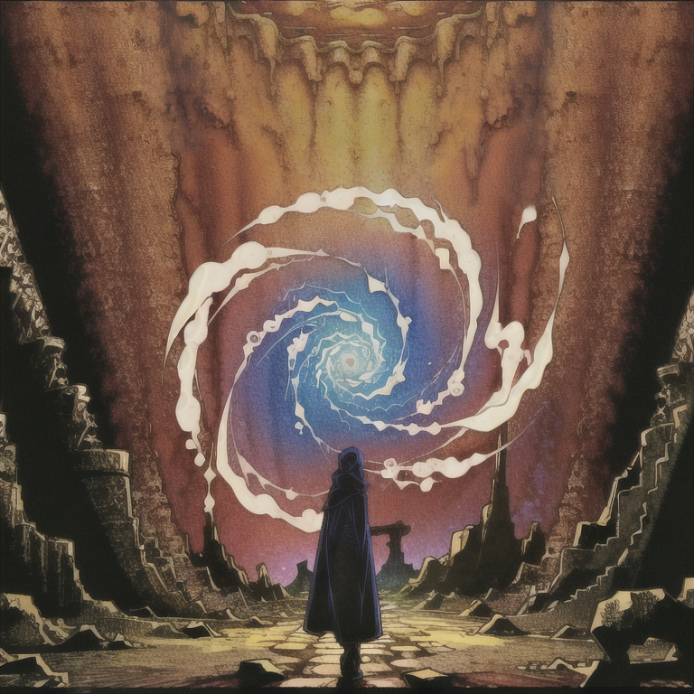

# Riftwalkers

## Features

- Adds the Escape Rift mental mutation, which spawns a space-time vortex at the
  player's location.
- Vortices spawned by the Space-Time Vortex mutation now spawn at the location
  selected by the player (rather than a random adjacent tile). The mutation cost
  of Space-Time Vortex is slightly increased.

**Warning:** this mod makes a few different changes to the behavior of the
Space-Time Vortex mutation. These changes may interfere with other mods you have
installed that also alter the behavior of this mutation.
